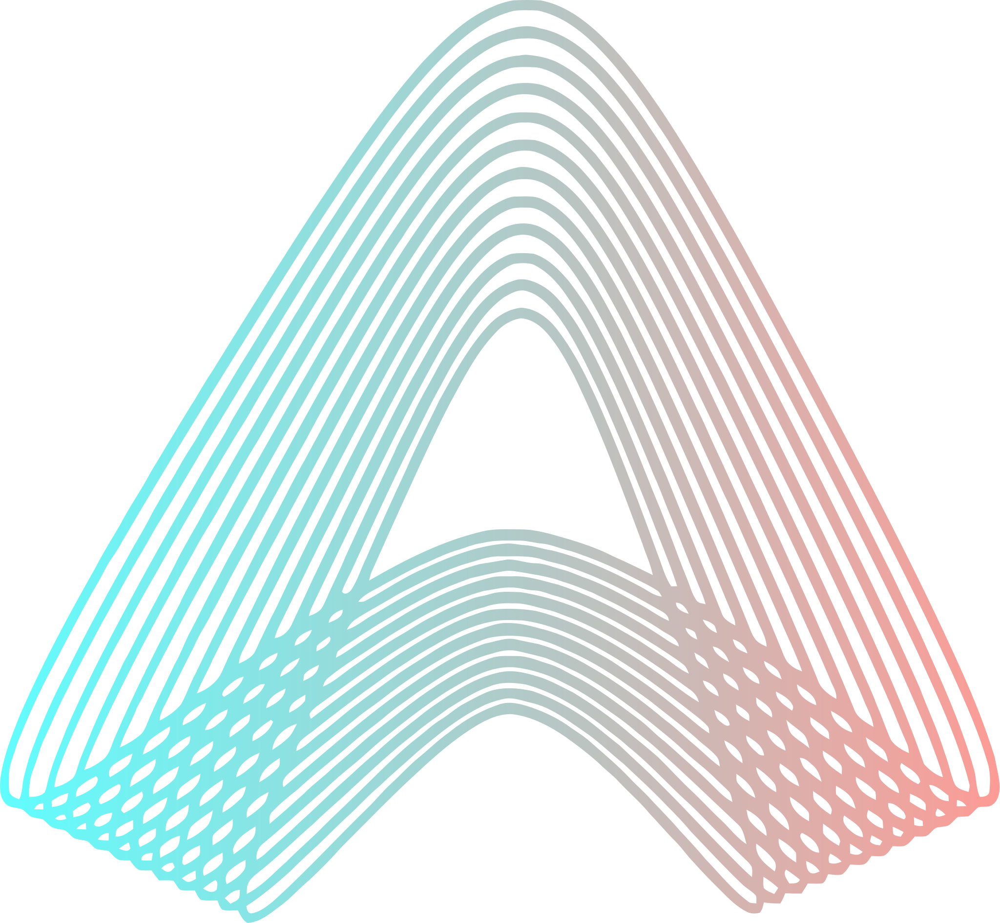

<div align="center">
  <br/>

# Aftermath Skills

<a href="/LICENSE"></a>
<a href="https://docs.aftermath.finance/for-developers/skills"></a>

A collection of AI-agent skills for interacting across the [Aftermath Finance](https://aftermath.finance) ecosystem.

</div>

## What Are Skills?

Skills are structured knowledge files that teach AI coding agents (like Claude, Cursor, Windsurf, etc.) how to effectively work with Aftermath's tools, APIs, and protocols. Each skill is a self-contained Markdown document that provides an agent with the context, patterns, and best practices it needs to accomplish tasks within a specific domain.

Think of them as specialized instruction sets — when you point your AI agent at a skill file, it gains deep knowledge about that part of the Aftermath ecosystem without needing to figure things out from scratch.

## Available Skills

| Skill | Description | Status |
|-------|-------------|--------|
| [API](./skills/api/aftermath-api.md) | Interact with the Aftermath public REST API — fetch market data, pool info, pricing, and more | ✅ Stable |

> More skills will be added as new integration surfaces arise. See [Roadmap](#roadmap) below.

## Getting Started

### With Claude Projects / Custom Instructions

Add the relevant `SKILL.md` file contents to your AI agent's system prompt or project knowledge base.

### With Claude Code / Cursor / Windsurf

Point the agent at the skill file directly:

```
Read ./skills/api/SKILL.md and use it to help me fetch pool data from the Aftermath API.
```

### With MCP or Tool-Augmented Agents

Include the skill file as a resource in your agent's context when making requests related to that domain.

## Repository Structure

```
aftermath-skills/
├── README.md
├── CONTRIBUTING.md             # How to contribute new skills
├── LICENSE                     # Apache License
└── skills/
    └── api/                    # One directory per skill
        └── aftermath-api.md    # The skill definition
```

Each skill lives in its own directory under `skills/`. A skill directory contains at minimum one skill file, but may also include supplementary files like example code, schemas, or reference data.

## Roadmap

Potential future skills (not yet available):

- **TypeScript SDK** — Working with the `aftermath-ts-sdk` to build integrations programmatically
- **Rust SDK** — Working with the `aftermath-sdk-rust` to build integrations programmatically
- **Move Contracts** — Understanding and interacting with Aftermath's on-chain Move modules

Have a suggestion? Open an [issue](../../issues) or see [CONTRIBUTING.md](./CONTRIBUTING.md).

## Contributing

We welcome community contributions! Whether it's improving an existing skill, fixing inaccuracies, or proposing an entirely new skill, check out [CONTRIBUTING.md](./CONTRIBUTING.md) for guidelines.

## License

This project is licensed under the Apache 2.0 License — see [LICENSE](./LICENSE) for details.
